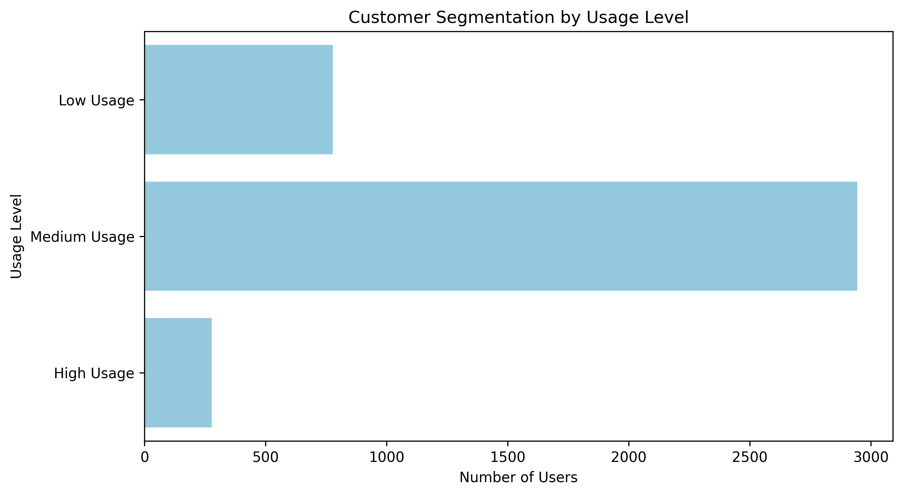
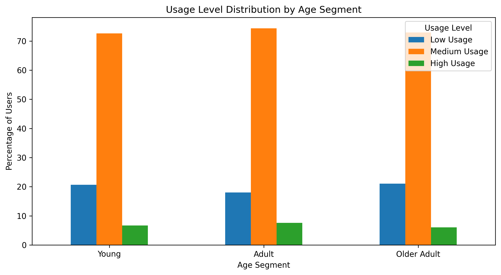
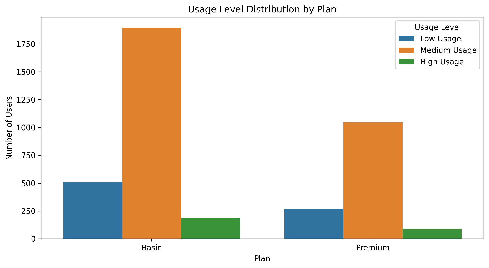

# ConnectaTel Customer Usage Analysis

This project analyzes customer usage patterns for ConnectaTel, a telecommunications company operating in Mexico and Colombia. By combining customer information with service usage records, the analysis explores calling and messaging behavior, identifies unusual consumption patterns, and develops customer segments based on demographic characteristics and usage levels.

> **Academic Project**
> This project was developed for educational purposes as part of a simulated business case. The role, business scenario, and recommendations are intended to demonstrate a data analytics workflow and should not be interpreted as official guidance for the organizations referenced.

---

## 📌 Project Overview

The project focuses on building a customer-level analytical profile from demographic, contractual, and service usage data.

The analysis evaluates data quality, aggregates individual usage events at the customer level, identifies extreme consumption patterns, and compares customer behavior across age segments and contracted plans.

---

## 🏢 Business Context

In this simulated business case, ConnectaTel seeks to better understand how its customers use calling and messaging services and whether observable usage patterns can support customer segmentation and commercial decision-making.

The analysis aims to identify dominant customer profiles, evaluate differences between plan users, and highlight opportunities for more targeted service offerings.

---

## 🎯 Analysis Objective

### Main Objective

Analyze customer calling and messaging behavior to identify usage patterns, detect unusual activity, and develop interpretable customer segments that may support commercial decision-making.

### Analysis Questions

- How do customers use calling and messaging services?
- Which customers present unusually high usage patterns?
- Does usage behavior differ across age segments?
- Are there meaningful differences in usage between Basic and Premium plan customers?
- What commercial opportunities can be identified from the observed customer segments?

---

## 📊 Data Sources

The analysis uses three datasets provided as part of the simulated business case.

### Customer Data

Contains demographic and contractual information for ConnectaTel customers, including age, city, registration date, and contracted plan.

### Usage Data

Contains individual calling and messaging activity records, including event type, call duration, and message length.

### Plan Data

Contains the characteristics of the available Basic and Premium plans, including pricing, included services, and additional usage costs.

The available usage records cover activity observed from January to June 2024.

---

## 🔎 Analysis Process

- Assessed data quality and identified missing, invalid, and structurally inconsistent values.
- Cleaned and standardized customer and usage records according to the dataset structure.
- Aggregated service activity to build a customer-level analytical profile.
- Explored usage distributions and detected extreme observations using the IQR method.
- Created rule-based customer segments and compared behavior across age groups and contracted plans.

---

## 🔑 Key Findings

### Medium-Usage Customers Represent the Majority of the Customer Base

Approximately **73.6% of customers are classified as Medium Usage**, while 19.5% belong to the Low Usage segment and approximately 7.0% show High Usage behavior.

The customer base is therefore primarily composed of moderate users, with a considerably smaller group of intensive customers.

### Age Does Not Strongly Explain Usage Behavior

Usage patterns remain highly similar across Young, Adult, and Older Adult customers. Approximately **73–74% of each age segment falls within the Medium Usage category**.

Based on the available data, age alone does not appear to be a strong differentiator of calling and messaging behavior.

### Basic and Premium Customers Show Similar Usage Patterns

Average calls, messages, and total call duration are very similar between Basic and Premium customers. The distribution of usage levels also follows a comparable pattern across both plans.

The available calling and messaging data does not clearly explain why customers select one plan over the other.

### Extreme Usage Patterns Were Identified

The IQR method identified upper-end outliers in messages, calls, and especially total call duration.

These observations were retained because they may represent legitimate intensive customers. However, they also provide an opportunity for further monitoring to distinguish high-value usage from unusual behavior.

---

## 💡 Recommendations

- Develop targeted offers for High Usage customers, focusing on benefits aligned with intensive calling and messaging behavior.
- Explore upselling opportunities within the Medium Usage segment, which represents more than 70% of the customer base.
- Avoid using age as the primary segmentation criterion for usage-based commercial strategies, since behavior remains similar across age groups.
- Monitor extreme usage patterns to differentiate legitimate intensive customers from potential anomalies.
- Incorporate mobile data consumption metrics into future analyses to better evaluate plan suitability, compare actual consumption against contracted allowances, and understand the differences between Basic and Premium customers.
- Explore broader behavioral variables and statistical segmentation techniques to evaluate whether additional customer profiles emerge from more complete usage data.

---

## ⚠️ Analysis Limitations

- The available usage dataset contains records for calls and text messages but does not include mobile data consumption.
- Although the plan catalog includes mobile data allowances, the absence of GB usage metrics prevents a complete evaluation of plan suitability.
- Comparisons between Basic and Premium customers are limited to calling and messaging behavior.
- Usage segments were created using predefined business rules based on calls and messages and should be interpreted as operational segments rather than statistically derived clusters.

---

## 🗂️ Repository Structure

    .
    ├── README.md
    ├── analysis_connectatel.ipynb
    ├── datasets/
    │   ├── plans.csv
    │   ├── usage.csv
    │   └── users_latam.csv
    └── images/
        ├── usage_level_by_age.png
        ├── usage_level_by_plan.png
        └── usage_level_segmentation.png

---

## 🛠️ Tools and Technologies

- Python
- pandas
- NumPy
- Matplotlib
- Seaborn
- Google Colab
- GitHub

---

## 🔄 Reproduction Process

The complete analysis can be reproduced directly in Google Colab without manually downloading or configuring the datasets.

1. Open the notebook using the **Open in Colab** button.
2. Select **Runtime → Run all**.
3. Allow the notebook to clone the GitHub repository and load the required datasets.
4. The complete workflow will execute sequentially, including data cleaning, customer profiling, statistical analysis, segmentation, and visualization.

No manual dataset upload or path configuration is required.

---

## 👤 Author

Edgar Rojas

Data Analytics Portfolio Project
